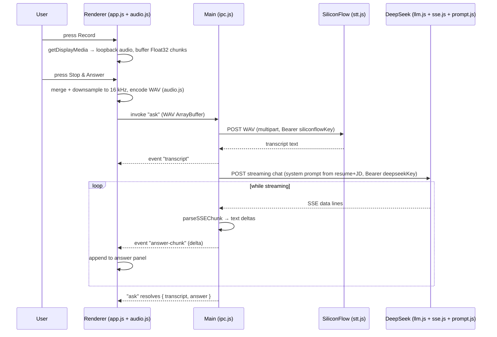

# Architecture

How a question travels from the caller's voice to a suggested answer on screen, and the contracts each module upholds. This documents the **stable contracts** (channel names, module responsibilities, data shapes) rather than line-level implementation, which is actively being hardened.

## The two worlds

Electron splits the app into two processes with deliberately different powers:

| | Renderer (`src/renderer/`) | Main (`src/main/`) |
|---|---|---|
| Runtime | Sandboxed Chromium page (`contextIsolation: true`, `nodeIntegration: false`) | Node.js |
| Owns | UI, audio capture, WAV encoding | Window, settings file, API keys, all network calls |
| Never sees | API keys*, filesystem, network | DOM |

\* The renderer's Settings screen does receive the saved settings object (including keys) via `settings:get` so it can populate the form fields; keys are never used for network calls outside the main process. (Tightening this is on the backlog — see `docs/CODE_REVIEW.md`.)

The **only** bridge between the worlds is `src/preload.js`, which exposes a five-method `window.api` object via `contextBridge`.

## The preload contract (`window.api`)

| Method | IPC channel | Direction | Payload |
|---|---|---|---|
| `getSettings()` | `settings:get` | invoke → main | none → returns settings object |
| `saveSettings(obj)` | `settings:set` | invoke → main | partial settings object (merged into the store) |
| `ask(wavArrayBuffer)` | `ask` | invoke → main | `ArrayBuffer` of a 16 kHz mono 16-bit PCM WAV → resolves `{ transcript, answer }` when the stream completes |
| `onTranscript(cb)` | `transcript` | event ← main | full transcript string, sent once STT finishes |
| `onAnswerChunk(cb)` | `answer-chunk` | event ← main | text delta; fires repeatedly while the LLM streams |

Errors thrown inside the `ask` handler reject the `invoke` promise; the renderer strips Electron's `Error invoking remote method 'ask':` prefix before display.

## Module responsibilities

**Main process** (`src/main/`):

- `main.js` — creates the always-on-top window, enables `setContentProtection(true)` (hide from screen share), and installs a `setDisplayMediaRequestHandler` that answers every `getDisplayMedia` call with Windows **system-audio loopback** (`audio: 'loopback'`) — this is how the app hears the call without a screen-picker prompt or virtual cables. Opens `https:` links externally.
- `ipc.js` — registers the three invoke handlers above. The `ask` handler is the pipeline orchestrator: transcribe → push `transcript` event → stream answer → push `answer-chunk` events.
- `store.js` — minimal JSON settings store at `%APPDATA%\AI Call Assistant\settings.json` (Electron `userData`). Keys used today: `siliconflowKey`, `deepseekKey`, `resume`, `jobDescription`, `alwaysOnTop`.
- `stt.js` — POSTs the WAV to SiliconFlow's transcription endpoint (SenseVoice model), returns trimmed text.
- `llm.js` — POSTs a streaming chat-completion request to DeepSeek with the system prompt from `prompt.js`; feeds raw response chunks through `sse.js` and forwards each text delta to its `onChunk` callback.
- `sse.js` — **pure** parser for OpenAI-style SSE. Handles `data:` lines split across network reads: call it with buffered text, it returns completed deltas plus the partial line to carry forward.
- `prompt.js` — **pure** builder of the system prompt ("answer as the user, first person, grounded in resume/JD").

**Renderer** (`src/renderer/`):

- `app.js` — the UI state machine (`idle → recording → processing → idle`). On Record it calls `getDisplayMedia` (routed to loopback by main), captures Float32 audio chunks, and on Stop merges/downsamples them to 16 kHz, WAV-encodes, and calls `window.api.ask(...)`. Also drives the Settings screen. Clips are capped at 120 s.
- `audio.js` — **pure** helpers: `mergeAndDownsample` (box-average resample) and `encodeWav` (16-bit PCM mono). UMD-wrapped so the same file serves the renderer (`window.AudioUtil`) and the Node test suite.

The three pure modules (`sse.js`, `prompt.js`, `audio.js`) have no Electron or network dependency and are what `npm test` covers.

## Data flow: record → transcribe → prompt → stream answer

## Where state lives

| State | Location | Lifetime |
|---|---|---|
| Settings (API keys, resume, JD, always-on-top) | `%APPDATA%\AI Call Assistant\settings.json`, mediated by `store.js` (in-memory cache + write-through) | persistent |
| Recording buffer (Float32 chunks) | renderer memory in `app.js` | one clip; discarded after encoding |
| UI state machine (`idle`/`recording`/`processing`) | `app.js` module variable | session |
| Transcript / streamed answer | DOM (`textContent` only — no HTML injection) | until the next question |
| In-flight pipeline | the `ask` invoke promise in the main process | one question |

Nothing is persisted about calls themselves: no audio, transcripts, or answers are written to disk.

## Security posture (stable invariants)

- Keys and network access confined to the main process; renderer sandboxed behind `preload.js`.
- Transcript/answer rendered via `textContent`; `index.html` ships a restrictive CSP.
- Window excluded from screen capture (`setContentProtection`, Windows 10 2004+).
- Zero runtime npm dependencies.

For known weaknesses and the hardening backlog (timeouts, cancellation, key handling), see [CODE_REVIEW.md](./CODE_REVIEW.md). For the v2 latency-focused redesign, see [../rewrite.md](../rewrite.md).
